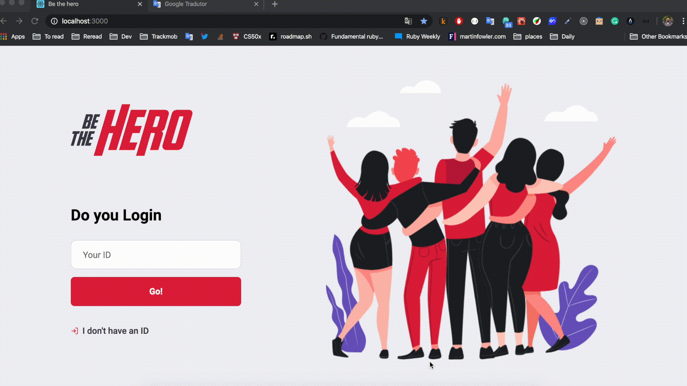

React frontend code for Be The Hero Application

# What is Be The Hero?

Be the hero in an application where Non Governmental Organizations (NGO's) can publish incidents trough a web page that they want to solve and the budget needed to solve the incident ir order to help someone/something. Afterwards, people from society can look in mobile app all incidents that NGO's has published, choose one or more, and enter in contact by Email or Whatsapp with the NGO and donate money in order to help with the budget for the incident.

## How NGO's can use the app:

#### Register NGO and Login:

#### Register a new incident:

#### Delete a incident:

How people from society can look for incidents to help?

## The whole application is composed by 3 software projects:

- react frontend: https://github.com/gustavomrs/frontend_be_the_hero
- react-native mobile app: https://github.com/gustavomrs/mobile_be_the_hero
- node.js backend: https://github.com/gustavomrs/backend_be_the_hero

Application demo URL:

Disclaimer: This is not an official application, it was created only for study purposes.